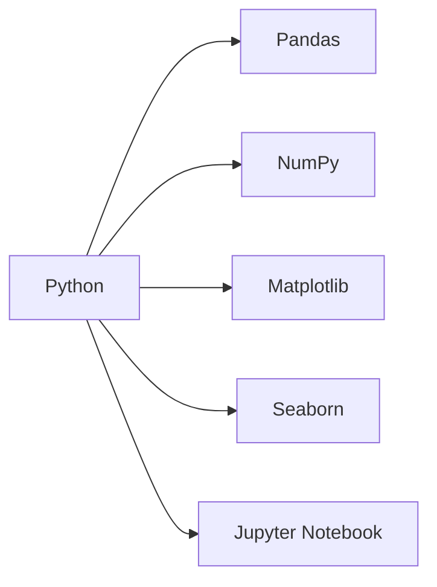

# Estatística com Python: Resumindo e Analisando Dados para Otimização de Negócios


## Contexto do Projeto

Este projeto simula uma consultoria de ciência de dados prestada a uma grande rede de varejo com atuação em todo o Brasil. Nosso objetivo é aplicar conceitos estatísticos para investigar e auxiliar na resolução de problemas e demandas da empresa, embasando decisões estratégicas através da análise de dados concretos.

O projeto está dividido em duas áreas principais:

1. **Análise do Público e Vendas**  
   Traçar o perfil da clientela, identificar padrões de compra e gerar insights para as equipes de marketing e vendas

2. **Análise da Remuneração dos Colaboradores**  
   Avaliar a estrutura salarial, analisar desempenho e identificar desigualdades para auxiliar o RH e setor financeiro

## Bases de Dados

| Dataset | Descrição | Variáveis Principais |
|---------|-----------|----------------------|
| **Vendas do E-commerce** | Dados de transações online | `id_compra`, `sexo_biologico`, `idade_cliente`, `regiao_cliente`, `categoria_produto`, `preco_unitario`, `quantidade`, `total_compra`, `tempo_entrega`, `avaliacao` |
| **Remuneração de Colaboradores** | Dados salariais e de desempenho | `id_colaborador`, `cargo`, `salario`, `tempo_de_casa`, `avaliacao_desempenho`, `genero` |

Os dados são importados diretamente de um [repositório GitHub](https://github.com/alura-cursos/Estatisticas-Python-frequencias-medidas/tree/main/dados).

## Metodologia e Ferramentas

### Abordagem Estatística
- Distribuições de frequência
- Medidas de tendência central (média, mediana, moda)
- Medidas separatrizes (quartis, percentis)
- Medidas de dispersão (variância, desvio padrão)
- Visualização de dados

### Stack Tecnológico


## Principais Etapas da Análise

### 1. Compreensão dos Dados
- Importação e exploração inicial
- Identificação de tipos de dados (qualitativos/quantitativos)
- Manipulação de variáveis categóricas ordinais

### 2. Análise do Perfil do Público
- Distribuição de frequências de variáveis únicas
- Cruzamento de múltiplas variáveis categóricas
- Segmentação de clientes por região, gênero e preferências

### 3. Análise de Tendências
- Cálculo de medidas de tendência central
- Relação entre média, mediana e moda
- Identificação de padrões de consumo

### 4. Investigação Salarial
- Construção de histogramas e boxplots
- Classificação por medidas separatrizes
- Análise de equidade salarial por gênero e cargo

### 5. Análise de Dispersão
- Cálculo de variância e desvio padrão
- Identificação de outliers
- Comparação de distribuições salariais

## Resultados Esperados

### Para Marketing e Vendas
- Identificação de perfis de clientes mais rentáveis
- Otimização de campanhas por segmento
- Melhoria na experiência do cliente baseada em avaliações
- Previsão de demanda por categoria de produtos

### Para RH e Finanças
- Diagnóstico de desigualdades salariais
- Proposta de plano de carreira mais justo
- Relação entre desempenho e remuneração
- Otimização da estrutura de custos

## Como Executar o Projeto

1. Clone o repositório:
```bash
git clone https://github.com/seu-usuario/projeto-estatistica-varejo.git
```

2. Instale as dependências:
```bash
pip install -r requirements.txt
```

3. Execute o Jupyter Notebook:
```bash
jupyter notebook Projeto_Final_Estatística_com_Python_resumindo_e_analisando_dados.ipynb
```

## Próximos Passos
1. Análise de correlação entre variáveis
2. Modelagem preditiva de vendas
3. Análise de cluster para segmentação avançada
4. Dashboard interativo para monitoramento contínuo

## Contribuição
Contribuições são bem-vindas! Sinta-se à vontade para:
- Reportar issues
- Sugerir melhorias
- Enviar pull requests

## Licença
Este projeto está licenciado sob a [MIT License](LICENSE).

---
**Desenvolvido por:** [Seu Nome]  
**Contato:** [seu.email@example.com]  
**LinkedIn:** [link para o seu perfil]
